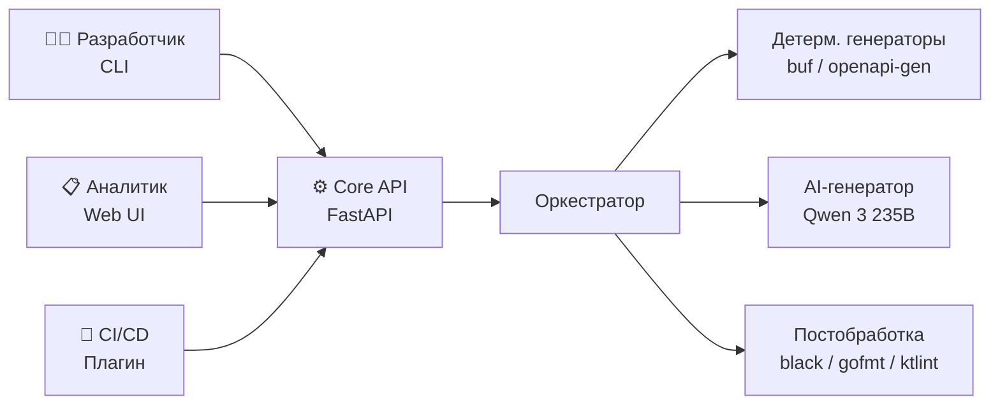
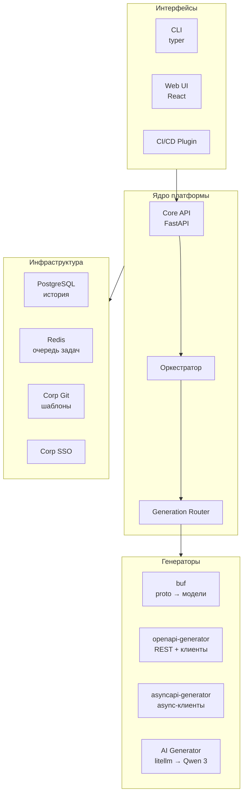
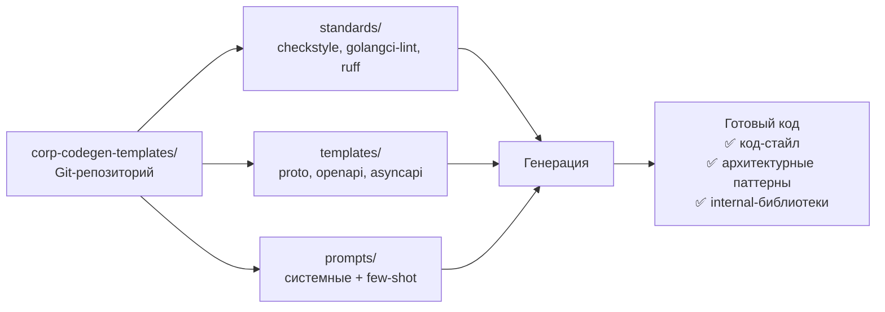

# AICreator

## Платформа AI-генерации кода для логистической платформы

  Апрель 2026 · Проект решения

---

# Разработчики тратят до 70% времени на бойлерплейт — мы это автоматизируем

<QuoteBlock color="brand">
  Платформа, которая генерирует код из формальных спецификаций — детерминированно где возможно, с помощью AI только для сложных задач
</QuoteBlock>

<v-clicks>

- **Сегодня** — каждая команда вручную пишет data-модели, REST-контроллеры, клиенты, скелеты сервисов
- **Возможность** — корпоративная AI-инфраструктура уже развёрнута, но не используется для генерации
- **Наш подход** — 75% детерминированная генерация + 25% AI, только скелет, не бизнес-логика

</v-clicks>

---

# 3 из 4 функций генерации полностью предсказуемы

<CompareTable
  :columns="['#', 'Функция', 'Вход', 'Выход', 'Генератор']"
  :rows="[
    ['1', 'Дата-модели', '.proto', 'Классы / структуры', 'buf (детерм.)'],
    ['2', 'REST-эндпоинты', 'OpenAPI', 'Контроллеры + middleware', 'openapi-generator (детерм.)'],
    ['3', 'Сервисы из PUML', '.puml', 'Интерфейсы + скелеты', 'AI — Qwen 3 235B'],
    ['4', 'API-клиенты', 'OpenAPI / AsyncAPI', 'HTTP / async-клиенты', 'openapi-gen (детерм.)'],
  ]"
  :highlight="4"
/>

<Callout type="info" title="Принцип">
  Детерминированные генераторы: один вход → всегда один и тот же выход. AI используется только там, где нет альтернативы.
</Callout>

---

# Почему не «всё на AI»? Потому что enterprise — это предсказуемость

### Детерминированная генерация (75%)

<v-clicks>

- Один вход → всегда один выход
- Работает без GPU и сети
- Мгновенный результат
- Нулевой риск галлюцинаций

</v-clicks>

### AI-генерация (25%)

<v-clicks>

- Только Функция 3: PUML → сервисы
- Скелет, не бизнес-логика
- Ограниченный контекст промпта
- Fallback на альтернативную модель

</v-clicks>

<StatHighlight value="75%" label="Генерации" sublabel="полностью предсказуемо" color="green" />

---
layout: section
---

<SectionDivider title="Архитектура" subtitle="Три интерфейса, одно ядро, модульная система" number="01" />

---

# Три интерфейса — один для каждого пользователя

<v-clicks>

- **CLI** — для разработчиков: `aicreator generate --from proto --to kotlin --spec order.proto`
- **Web UI** — для системных аналитиков: загрузка спеки → получение кода в браузере
- **CI/CD** — автоматическая генерация при изменении спецификаций

</v-clicks>

---

# Модульная архитектура — каждый компонент заменяем

---

# Проверенный open-source стек без vendor lock-in

<CompareTable
  :columns="['Компонент', 'Технология', 'GitHub Stars', 'Роль']"
  :rows="[
    ['CLI', 'typer', '16k+', 'Python CLI-фреймворк'],
    ['API', 'FastAPI', '80k+', 'Async REST API'],
    ['Proto-генерация', 'buf', '13k+', 'Protobuf тулчейн'],
    ['OpenAPI-генерация', 'openapi-generator', '23k+', '50+ языков'],
    ['AI-интеграция', 'litellm', '16k+', 'Model-agnostic прокси'],
    ['Шаблоны', 'Jinja2', '10k+', 'Шаблонизатор'],
  ]"
  :highlight="-1"
/>

<Callout type="info" title="Критерий отбора">
  Только OSS с 700+ stars, активным сообществом и регулярными релизами
</Callout>

---

# Мы переиспользуем уже развёрнутую AI-инфраструктуру — новые GPU не нужны

<v-clicks>

- **Qwen 3 235B** — основная модель генерации
- **GLM 4.7** — fallback-модель для тестов
- OpenAI-compatible API — нативная интеграция
- Смена модели через конфигурацию, без кода

</v-clicks>

  <KpiCard value="0" label="Новых GPU" subtitle="переиспользуем" color="green" />
  <KpiCard value="2" label="Модели" subtitle="Qwen + GLM" color="blue" />

<Callout type="warning" title="Model-agnostic">
  litellm абстрагирует API — при появлении новых моделей достаточно обновить конфигурацию
</Callout>

---

# Корпоративные стандарты встроены в генерацию — код соответствует с первого раза

<v-clicks>

- Шаблоны и стандарты версионируются через git tags
- Обновление через PR — полный audit trail
- Линтеры и форматтеры в постобработке как финальный гейт

</v-clicks>

---
layout: section
---

<SectionDivider title="Сценарии использования" subtitle="CLI, Web UI, CI/CD — три пути к одному результату" number="02" />

---

# Разработчик: одна команда → файлы в проекте

<ProcessFlow :steps="[
  { title: 'Спецификация', description: 'order.proto в Git' },
  { title: 'CLI-команда', description: 'aicreator generate --from proto --to kotlin' },
  { title: 'Core API', description: 'Роутинг → buf (детерм.)' },
  { title: 'Постобработка', description: 'ktlint форматирование' },
  { title: 'Результат', description: 'Файлы в ./generated/' },
]" color="blue" />

**Аналитик через Web UI:** загрузка PUML → выбор языка → AI-генерация скелета → скачивание или Merge Request

**CI/CD автоматически:** обновил OpenAPI в Git → pipeline пересоздал клиенты → автоматический MR

---
layout: section
---

<SectionDivider title="Безопасность и качество" subtitle="Enterprise-grade гарантии на каждом уровне" number="03" />

---

# Безопасность: изолированная среда, полный аудит, без утечек

<v-clicks>

- **Сеть** — все зависимости во внутренних реестрах, нет внешнего доступа
- **Аутентификация** — SSO (Web UI), API-ключи (CLI/CI)
- **Секреты** — Vault, ротация, без хардкода
- **Аудит** — кто, что, когда, какая модель

</v-clicks>

<v-clicks>

- **SAST** — сгенерированный код проходит существующие гейты
- **AI-промпты** — не содержат ПД и коммерческую тайну
- **Rate limiting** — защита от CI/CD-циклов
- **CORS** — только домен Web UI

</v-clicks>

---

# 5 уровней тестирования гарантируют качество генерации

<ProcessFlow :steps="[
  { title: 'Unit', description: 'pytest, 80%+ покрытие ядра' },
  { title: 'Интеграция', description: 'спека → генерация → компиляция' },
  { title: 'Golden-файлы', description: 'регрессия при смене шаблонов' },
  { title: 'AI-метрики', description: 'компилируемость, линтинг, оценка' },
  { title: 'E2E', description: 'полный цикл CLI/API/UI' },
]" color="green" />

<Callout type="info" title="Обработка ошибок">
  4 уровня ошибок: валидация → генерация → AI → постобработка. При отказе AI — функции 1, 2, 4 продолжают работать.
</Callout>

---
layout: section
---

<SectionDivider title="Реализация" subtitle="6 фаз, первый результат через 6 недель" number="04" />

---

# План реализации: от инфраструктуры до пилота за 5-7 месяцев

<Timeline :items="[
  { label: 'Инфраструктура', date: '2-3 нед.', status: 'pending' },
  { label: 'Фундамент (CLI + Ф1,Ф4)', date: '4-6 нед.', status: 'pending' },
  { label: 'Полная детерм. генерация', date: '4-6 нед.', status: 'pending' },
  { label: 'AI-генерация (PUML)', date: '4-6 нед.', status: 'pending' },
  { label: 'Web UI + SSO', date: '4-6 нед.', status: 'pending' },
  { label: 'Пилот', date: '4 нед.', status: 'pending' },
]" />

  <KpiCard value="6-9" label="недель" subtitle="до первого MVP" color="brand" />
  <KpiCard value="22-31" label="недель" subtitle="полный цикл" color="blue" />
  <KpiCard value="1-2" label="команды" subtitle="в пилоте" color="green" />

---

# Ключевые deliverables по фазам

<CompareTable
  :columns="['Фаза', 'Результат', 'Пользователь получает']"
  :rows="[
    ['0 — Инфраструктура', 'Реестры, CI/CD, DB', 'Готовое окружение'],
    ['1 — Фундамент', 'CLI + API + proto→модели + клиенты', 'Генерация через CLI на 1 языке'],
    ['2 — Детерм.', 'Все языки + REST + AsyncAPI + CI/CD', 'Полная детерминированная генерация'],
    ['3 — AI', 'PUML→сервисы через Qwen 3', 'Скелеты сервисов из диаграмм'],
    ['4 — Web UI', 'React UI + SSO + мониторинг', 'Аналитики работают в браузере'],
    ['5 — Пилот', 'Метрики, фидбэк, план масштабирования', 'Подтверждённая ценность'],
  ]"
  :highlight="-1"
/>

---

# Пилот: 1-2 команды, объективные метрики, решение о масштабировании

### Формат пилота

<v-clicks>

- 1 команда Java/Kotlin + 1 команда Go
- У обеих уже есть proto/OpenAPI спеки
- 4 недели активного использования
- Еженедельный сбор фидбэка

</v-clicks>

### Метрики успеха

  <KpiCard value="ч/нед" label="Сэкономлено" subtitle="на команду" color="green" />
  <KpiCard value="%" label="Без правок" subtitle="прошло code review" color="blue" />
  <KpiCard value="%" label="Адопция" subtitle="регулярное использование" color="brand" />
  <KpiCard value="NPS" label="Удовлетворённость" subtitle="пользователей" color="purple" />

---

# Ресурсы: компактная команда, существующая инфраструктура

### Команда

<v-clicks>

- **2-3** Python-бэкенд разработчика
- **1** React-фронтенд (с Фазы 4)
- Итого: **3-4 человека**

</v-clicks>

### AI-инфраструктура

<v-clicks>

- Qwen 3 235B / GLM 4.7 — уже развёрнуты
- **Новые GPU не нужны**

</v-clicks>

### Инфраструктура (as Service)

<v-clicks>

- PostgreSQL — уже есть
- Redis — уже есть
- Container registry — уже есть
- CI/CD pipeline — уже есть

</v-clicks>

### Для уточнения

<v-clicks>

- Состав команды разработки
- Выбор пилотных команд
- Детали K8s / Vault / CI/CD

</v-clicks>

---

# Управляемые риски с конкретными планами митигации

<CompareTable
  :columns="['Риск', 'Вероятность', 'Митигация']"
  :rows="[
    ['AI-генерация ниже ожиданий', 'Средняя', 'A/B тестирование моделей, fallback, только скелет'],
    ['Команды не примут инструмент', 'Средняя', 'Гибрид CLI+UI, пилот с мотивированными командами'],
    ['OSS недоступны в изол. сети', 'Низкая', 'Предзагрузка в Фазе 0, проверка до старта'],
    ['Переполнение контекста LLM', 'Низкая', 'Разбиение диаграмм, мониторинг размера'],
  ]"
  :highlight="-1"
/>

<Callout type="info" title="Устойчивость">
  При полном отказе AI — 3 из 4 функций продолжают работать (детерминированные генераторы)
</Callout>

---

# Что получит компания: скорость, стандарты, масштаб

  <FeatureCard title="Ускорение разработки" color="brand">
    Автоматизация 60-70% бойлерплейта на логистической платформе
  </FeatureCard>
  <FeatureCard title="Стандартизация" color="blue">
    Весь генерируемый код соответствует корпоративным требованиям с первого раза
  </FeatureCard>
  <FeatureCard title="Масштабируемость" color="green">
    После пилота — тиражирование на все стримы разработки
  </FeatureCard>
  <FeatureCard title="Использование AI-инфраструктуры" color="purple">
    Практическое применение уже развёрнутых Qwen 3 / GLM 4.7
  </FeatureCard>

---
layout: end
---

# Решение спроектировано, план готов — нужно одобрение на запуск

## Запрос: согласование состава команды и запуск Фазы 0

**Следующие шаги:**

1. Согласовать состав команды разработки
2. Выбрать пилотные команды (Java/Kotlin + Go)
3. Уточнить инфраструктурные детали (K8s, Vault, CI/CD)
4. Запуск Фазы 0 — подготовка инфраструктуры

